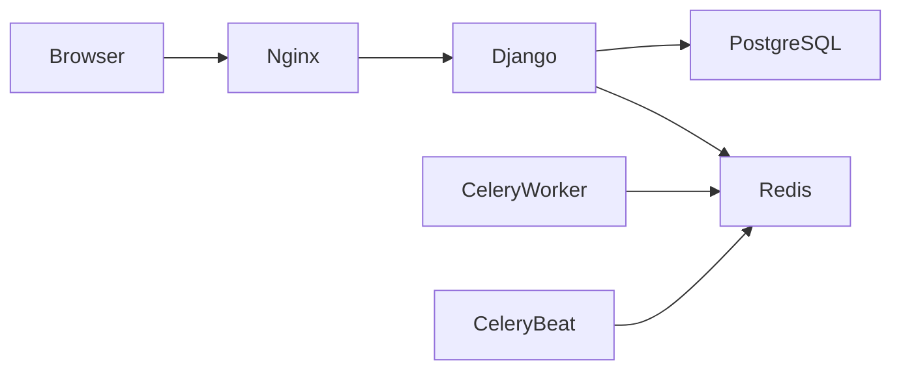
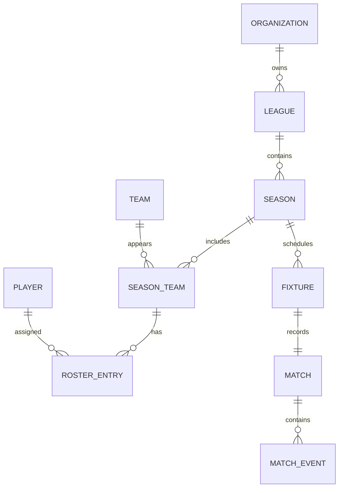

# LeagueHub

LeagueHub is an application for managing amateur football leagues. It
will eventually cover organizations, seasons, teams, rosters, fixtures, live
match events, standings, statistics, and notifications.

This repository is being built stage by stage as a learning project. It now
contains the backend foundation, Django session authentication, multi-tenant
organizations/RBAC, the league competition domain, deterministic round-robin
fixture generation, match lifecycle events, and derived standings/statistics.

The current release also includes a production-like Docker profile with Nginx,
secure environment-driven settings, health checks, and an idempotent demo data
command.

## Stack

- Backend: Python 3.13, Django 6.0, Django REST Framework, PostgreSQL, Redis,
  django-cors-headers
- Frontend: React, TypeScript, Vite, pnpm
- Tooling: uv, Ruff, Docker Compose

## Prerequisites

The primary development environment is Ubuntu 24.04 in WSL with Docker Engine
and Docker Compose available. Install `uv`, Node.js 24+, and pnpm before
following the commands below.

## Local setup

From the repository root in WSL:

```bash
cp .env.example .env

docker compose up -d --wait
```

If port `6379` is already used by another local Redis instance, choose a
different host port without changing the committed Compose defaults:

```bash
REDIS_HOST_PORT=6380 docker compose up -d --wait
```

```bash
cd backend
set -a
source ../.env
set +a
uv sync --dev
uv run python manage.py migrate
uv run python manage.py runserver 0.0.0.0:8000
```

In another terminal:

```bash
cd frontend
pnpm install
pnpm dev --host 0.0.0.0
```

The frontend is available at `http://localhost:5173` and the Django
development server at `http://localhost:8000`. The API health check is
available at `/api/v1/health/`. Session authentication uses
`/api/v1/auth/csrf/`, `/api/v1/auth/register/`, `/api/v1/auth/login/`,
`/api/v1/auth/logout/`, and `/api/v1/auth/me/`. Interactive OpenAPI docs are
at `/api/docs/` and the raw schema is at `/api/schema/`.

Organization management uses `/api/v1/organizations/` and nested `members/`
endpoints. Each organization has `OWNER`, `ADMIN`, and `MEMBER` roles. The
backend scopes organization QuerySets by the authenticated user's membership;
frontend checks are never treated as a security boundary.

The competition domain contains `League`, `Season`, `Team`, `SeasonTeam`,
`Player`, and `RosterEntry`. A team is attached to a season through
`SeasonTeam`, while a player is attached to a seasonal team through
`RosterEntry`. Competition API routes are nested under an organization and
enforce the same backend membership and manager permissions.

Fixture generation is available at the season-level `fixtures/` endpoint. A
single round robin creates one pairing for every team pair; a double round
robin adds the reversed home/away pairing. Generation is deterministic,
transactional, and rejects a second request for the same season.

Stage 6 adds the match lifecycle and match events. A fixture can have one
`Match`, whose state moves through explicit transitions such as `SCHEDULED`,
`LIVE`, `FINISHED`, `CANCELLED`, and `POSTPONED`. Events are accepted only for
live matches, and a goal updates the corresponding home or away score in the
same database transaction as the event. Players must be rostered for the
fixture's season and team. Match and event routes are nested under the same
organization/league/season scope and manager writes are enforced server-side.

Stage 7 adds derived season standings at `standings/` using only `FINISHED`
matches and the 3/1/0 scoring system. Rows are ordered by points, goal
difference, goals for, team name, and team ID. Player statistics and the top
scorers list are available under `statistics/players/` and
`statistics/top-scorers/`; they aggregate finished-match goals and cards from
`MatchEvent`. Appearances are intentionally not reported yet because the
domain does not store lineups or minutes played. Aggregation queries use
related filters and dedicated indexes to avoid N+1 event lookups.

Stage 8 hardens collection endpoints with optional page-number pagination.
Add `page=1&page_size=20` to receive `count`, `next`, `previous`, and
`results`; without those parameters, the existing list response remains
available. Organizations, leagues, seasons, teams, players, rosters, fixtures,
matches, standings, and player statistics support safe search/order options
where they are meaningful. Match collections also accept comma-separated
status filters. Invalid query parameters and other API exceptions use a
consistent `detail`, `code`, and (for validation) `fields` response shape.

Stage 9 adds the React authentication foundation. The SPA uses React Router,
TanStack Query, and a small fetch-based API client. Session cookies are sent
with `credentials: include`; mutating requests first obtain the Django CSRF
cookie and echo it in `X-CSRFToken`. The public routes are `/login` and
`/register`; authenticated users are redirected to `/dashboard`, where their
organizations are loaded from the API. Vite proxies `/api` to the local Django
server during development.

Stage 10 adds the league-management UI. From the dashboard, an authenticated
user can create an organization and open it to view and manage leagues,
seasons, teams, players, seasonal team assignments, and rosters. Manager-only
forms use React Hook Form with Zod schemas for immediate client-side feedback;
the API remains the source of truth and performs its own validation and
authorization. TanStack Query owns server state, scopes cache keys by
organization/league/season/team IDs, and invalidates the affected collection
after each successful mutation. The page explicitly handles loading, error,
and empty states for every collection.

Stage 11 adds the league dashboard at `/leagues/:leagueId`. The dashboard keeps
the organization and selected season in the URL, then uses TanStack Query to
load league information, fixtures, matches, standings, teams, and player
statistics. Its overview highlights upcoming fixtures, recent results, the
table, and top scorers; dedicated routes expose fixtures, table, teams,
statistics, and match detail views. These are read-only views over the existing
REST API; live updates are intentionally deferred to the WebSocket work in
Stage 12.

Stage 12 adds the live match center. Django Channels exposes an authenticated
WebSocket at the match scope, while HTTP remains responsible for lifecycle
commands and event mutations. Successful match creation, transitions, and
events schedule a post-commit snapshot for the Redis channel group, so a
failed transaction is never broadcast. The React match view subscribes to the
socket, updates the TanStack Query match/event cache, displays connection
status, and retries with exponential backoff after a disconnect. The Vite
development proxy forwards `/ws` to the ASGI server.

Stage 13 adds background jobs and in-app notifications. Celery uses Redis as
its broker and result backend; Celery Beat scans a small 24-hour window every
15 minutes for scheduled-match reminders. Finishing a match enqueues a
post-match notification after the database transaction commits. Notification
dedupe keys make task delivery idempotent, and only transient connection or
timeout errors are eligible for bounded retry. Authenticated users can read
their own notifications at `/api/v1/notifications/` and mark them as read;
the React shell exposes the same data in a small notification menu.

Run the background processes from `backend/` in separate terminals during
development:

```bash
uv run celery -A config worker --loglevel=INFO
uv run celery -A config beat --loglevel=INFO
```

For a browser client, request `/api/v1/auth/csrf/` first, then send the
`csrftoken` cookie value in the `X-CSRFToken` header for register, login, and
logout. Cross-origin requests must include credentials; local origins are
configured through `DJANGO_CORS_ALLOWED_ORIGINS`.

Development settings use PostgreSQL from Compose. Pytest uses an isolated
in-memory SQLite database so unit tests do not depend on a running service.

## Production-like local run

Copy the example values, replace the marked secret/passwords, then start the
complete stack (Nginx, Django, PostgreSQL, Redis, Celery worker and beat):

```bash
cp .env.production.example .env.production
docker compose --env-file .env.production -f compose.production.yml up -d --build --wait
docker compose --env-file .env.production -f compose.production.yml exec backend python manage.py seed_demo
```

Open `http://localhost:8080`, sign in with `demo@leaguehub.app` and the
password `demo1234`, and browse the seeded league. Stop it without deleting
named volumes with:

```bash
docker compose --env-file .env.production -f compose.production.yml down
```

Production settings require `DJANGO_SECRET_KEY`, set `DEBUG=False`, restrict
hosts/origins, and enable secure cookies/HSTS by default. The checked-in local
example disables TLS-only flags because it intentionally serves plain HTTP;
set them to `true` behind HTTPS.

## Architecture and domain model





See [architecture](docs/architecture.md), [domain model](docs/domain-model.md),
[trade-offs](docs/tradeoffs.md), and [interview notes](docs/interview-notes.md)
for detailed design, constraints, and the demo flow.

## Demo data

`python manage.py seed_demo` builds one organization, a league and season,
twelve clubs with full squads, a complete double round robin of 132 fixtures,
and results for roughly the first 60 per cent of the calendar. Scores come from
seeded match events, so standings and player statistics are derived from the
same data an operator would enter by hand.

The command is idempotent: running it again leaves the existing dataset alone.
Pass `--flush` to discard the seeded records and rebuild them.

```bash
python manage.py seed_demo --flush
```

It creates three accounts, one per role, all with the password `demo1234`:

| Email | Role |
| --- | --- |
| `demo@leaguehub.app` | Owner |
| `admin@leaguehub.app` | Admin |
| `member@leaguehub.app` | Member |

The sign-in screen offers the owner account behind a single button. The
frontend reads it from `VITE_DEMO_EMAIL` and `VITE_DEMO_PASSWORD`; build with
an empty `VITE_DEMO_EMAIL` to hide that block entirely.

Stop the infrastructure when finished:

```bash
docker compose down
```

## Verification

Stage checks are documented and run before each stage commit:

```bash
cd backend
uv run ruff check .
uv run python manage.py check
uv run pytest
uv run python manage.py makemigrations --check --dry-run

cd ../frontend
pnpm lint
pnpm test
pnpm e2e
pnpm build
```

GitHub Actions runs the backend checks, frontend lint/typecheck/unit tests and
production build, plus the Playwright smoke test on every push and pull
request to `main`.

## Repository layout

```text
leaguehub/
├── backend/
├── frontend/
├── docs/
├── compose.yml
├── compose.production.yml
├── .env.example
├── .env.production.example
└── README.md
```
