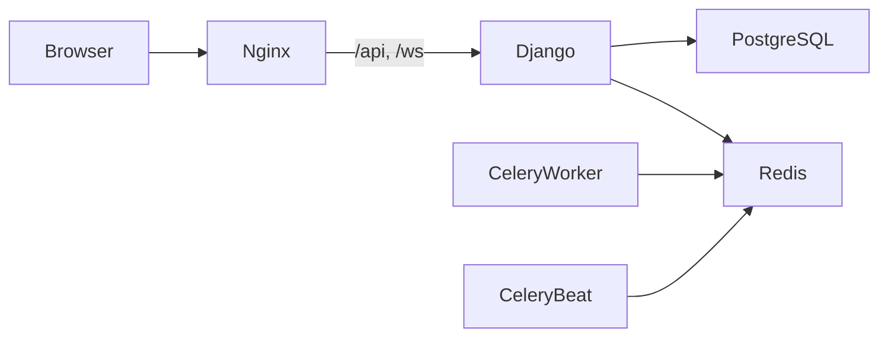

# Architecture

LeagueHub is a Django monolith with a React single-page client. Nginx is the
only public container in the production-like profile and proxies `/api/` and
`/ws/` to Django ASGI. PostgreSQL is the source of truth; Redis backs Channels
and Celery. Worker and beat processes share the backend image and settings.

HTTP mutations remain transactional and publish live updates after commit.
Celery handles reminders and post-match notifications. The frontend owns
presentation and cache state; authorization is always enforced server-side.
