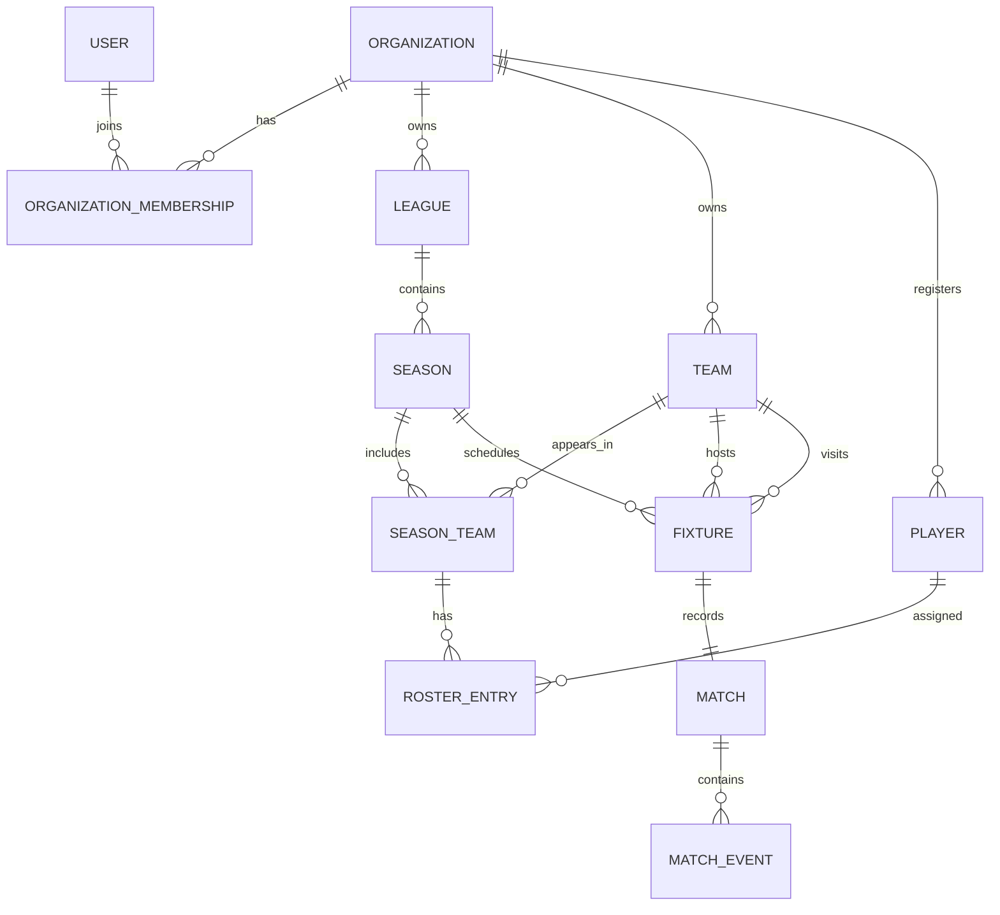

# Domain model

`SeasonTeam` and `RosterEntry` preserve historical membership: a club and a
player can participate in different seasons without rewriting past data.
`Match` is one-to-one with a fixture, while events are append-only records
validated against the live match and its seasonal rosters.
